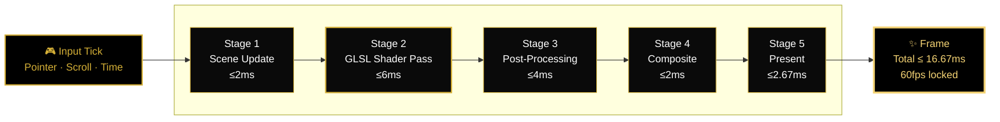
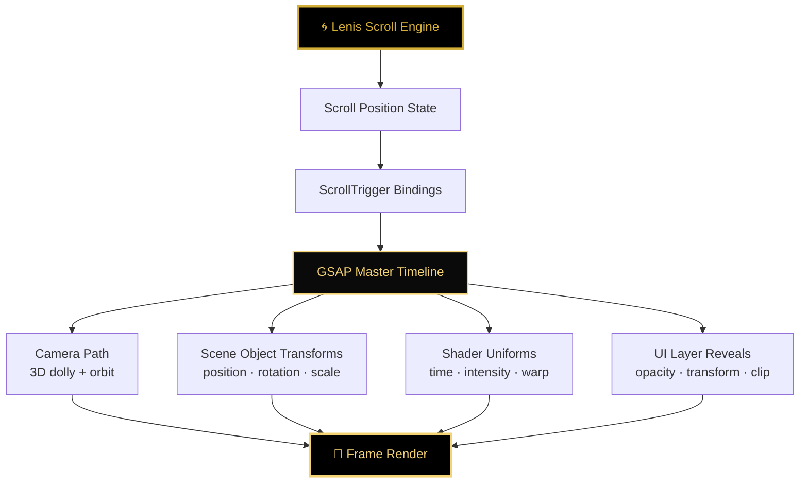

<div align="center">

```
██╗   ██╗██████╗     ██╗     ██╗███████╗███████╗    ██╗███████╗    ██╗   ██╗██████╗
██║   ██║██╔══██╗    ██║     ██║██╔════╝██╔════╝    ██║██╔════╝    ██║   ██║██╔══██╗
██║   ██║██████╔╝    ██║     ██║█████╗  █████╗      ██║███████╗    ██║   ██║██████╔╝
██║   ██║██╔══██╗    ██║     ██║██╔══╝  ██╔══╝      ██║╚════██║    ██║   ██║██╔═══╝
╚██████╔╝██║  ██║    ███████╗██║██║     ███████╗    ██║███████║    ╚██████╔╝██║
 ╚═════╝ ╚═╝  ╚═╝    ╚══════╝╚╝╚╝     ╚══════╝    ╚═╝╚══════╝     ╚═════╝ ╚═╝

              ▓▓▓  V O I D · G O L D · D O M I N A N C E  ▓▓▓
```

# **UR LIFE IS UP**

### *Absolute Focus · Zero Friction · Pure Dominance*

> A WebGL ceremony for the operator who refuses average.
> Built to be felt — not read.
> Engineered to hit at 60fps minimum. 120fps where the silicon allows.

[]()
[]()
[]()
[]()
[]()

[**Manifesto**](#-the-manifesto) ·
[**Aesthetic**](#-the-aesthetic-doctrine) ·
[**Pipeline**](#-the-render-pipeline) ·
[**Choreography**](#-the-motion-choreography) ·
[**Budget**](#-the-frame-budget) ·
[**Stack**](#-the-stack) ·
[**Build**](#-the-build)

</div>

---

## 🜂 The Manifesto

This is not a website.
This is not a portfolio.
This is not a landing page.

**This is a ceremony.**

Every shader, every easing curve, every millisecond of frame time was chosen to deliver one message to the cortex of whoever lands on it:

> **You were not built for ordinary. Act accordingly.**

The medium is the message. The performance is the proof.

---

## 👁 The Operator's Promise

| | |
| :--- | :--- |
| **What it is** | A 3D WebGL platform engineered as a cognitive trigger — visual proof that excellence is non-negotiable. |
| **What it does** | Reprograms the visitor's sense of standard. Every frame at 60fps minimum. Every interaction frictionless. |
| **What it isn't** | A theme. A template. A WordPress build with extra steps. |
| **Who it's for** | Operators, founders, traders, and creators who treat their digital surface as a weapon. |
| **The proof** | The site itself. Open it. Feel it. The argument is the experience. |

---

## ⚜ The Aesthetic Doctrine

Two colors. Zero compromise.

| Token | Hex | RGB | Function |
| :--- | :---: | :---: | :--- |
| **Void Black** | `#000000` | `0, 0, 0` | The substrate. The infinite. The frame that lets the gold breathe. |
| **Luxury Gold** | `#D4AF37` | `212, 175, 55` | The signal. The accent. The single permitted indulgence. |
| **Shadow Gold** | `#8B7028` | `139, 112, 40` | The fade. The recess. The depth carrier. |
| **Highlight Gold** | `#F4D374` | `244, 211, 116` | The glint. Reserved for hover, focus, and apex moments. |
| **Off-Black** | `#0A0A0A` | `10, 10, 10` | Surface separation when pure black would lose layer hierarchy. |

### The Three Rules of the Palette

1. **No grays.** Grays are indecision. We use off-black or shadow gold.
2. **No alternate accents.** Gold is the only signal color. Anything else dilutes the verdict.
3. **Light is gold. Dark is void. There is no third state.**

### Typography Voice

| Layer | Family | Weight | Purpose |
| :--- | :--- | :---: | :--- |
| **Display** | Geometric serif, condensed | 900 | Declarations. Verdicts. Single-word slabs. |
| **Body** | Geometric sans, mono variant | 400–500 | Mechanical clarity. Operator-grade. |
| **Numeric** | Tabular monospace | 500 | Metrics, prices, frame counts, timestamps. |

---

## 🎯 The Render Pipeline

Every frame travels through a five-stage pipeline. **No stage exceeds its declared budget. Ever.**



### Stage Detail

| Stage | What Runs | Budget | Failure Behavior |
| :--- | :--- | :---: | :--- |
| **1 · Scene Update** | Camera lerp, object transforms, scroll-driven state | 2ms | Skip non-essential transforms |
| **2 · GLSL Shader Pass** | Custom vertex + fragment shaders, instanced geometry | 6ms | Drop to lower-LOD shader variant |
| **3 · Post-Processing** | Bloom, chromatic aberration, gold-luma filter | 4ms | Disable post pass entirely |
| **4 · Composite** | Layer blend, final color grade | 2ms | Hard skip — composite at next vsync |
| **5 · Present** | Submit to GPU, vsync | 2.67ms | Browser-controlled |

---

## 🎬 The Motion Choreography

Motion is not decoration. **Motion is the operator's heartbeat made visible.**

### The Layered System

| Layer | Library | Responsibility | Easing Default |
| :--- | :--- | :--- | :--- |
| **Scroll** | Lenis Smooth Scroll | Inertial scroll, no jank, momentum-preserved | `expo.out` |
| **Timeline** | GSAP | Sequenced animations, scrubbable, chained | `power3.inOut` |
| **Trigger** | ScrollTrigger | Bind animations to scroll position with sub-pixel precision | n/a |
| **Camera** | Three.js + custom lerp | 3D camera path, viewport-aware | `power2.out` |
| **Shader** | GLSL uniforms | Time-driven shader parameters, additive layer | `linear` (handled in shader) |

### Choreography Architecture



### Motion Principles

1. **Nothing pops. Everything emerges.** No instant appearances. No hard cuts.
2. **Easing is the voice.** Default to `expo.out` for entries, `power3.inOut` for sequences, `power2.out` for camera.
3. **Scroll is sacred.** Every scroll-bound animation is scrubbable in both directions, deterministic, no setTimeout dependencies.
4. **Time-bound, never event-bound** for the master timeline. Events trigger state transitions, not animations directly.

---

## ⏱ The Frame Budget

Hard contract with the GPU. No negotiations.

| Target | Frame Budget | Allowed Drops/min | Adaptive Action at Breach |
| :--- | :---: | :---: | :--- |
| **120fps (high-tier hardware)** | 8.33ms | 0 sustained | Drop to 60fps tier instantly |
| **60fps (default)** | 16.67ms | < 3 single-frame stutters | Reduce resolution scale by 10% |
| **45fps (mobile / low-tier)** | 22.22ms | < 5 single-frame stutters | Disable post-processing |
| **30fps (last resort)** | 33.33ms | n/a | Disable particles + reduce shader complexity |

### Adaptive Resolution Scaling

The renderer constantly measures frame time. **If the rolling average drifts above budget for more than 1 second, resolution scales down. If it stays comfortably under budget for 5 seconds, resolution scales back up.**

```
RESOLUTION_SCALE = clamp(
  baseScale × (targetFrameTime / actualFrameTime),
  0.50,
  device.pixelRatio
)
```

### Hardware Tier Detection

On first paint, the platform probes:

| Signal | Source | Decision |
| :--- | :--- | :--- |
| Logical CPU cores | `navigator.hardwareConcurrency` | < 4 → low tier · 4–8 → mid · > 8 → high |
| GPU vendor | `WEBGL_debug_renderer_info` | Tier-map known GPU families |
| Device pixel ratio | `window.devicePixelRatio` | Cap render scale to 2.0 max |
| Memory hint | `navigator.deviceMemory` | < 4GB → reduce particle count |
| Touch / pointer | `navigator.maxTouchPoints` | Mobile path → mobile motion profile |
| Reduced motion | `prefers-reduced-motion` | Strip non-essential motion entirely |

**The site never asks the user to wait. It adapts to their machine.**

---

## 🛠 The Stack

| Layer | Technology | Why This, Not That |
| :--- | :--- | :--- |
| **3D Engine** | Three.js (r155+) | Mature, performant, full WebGL2 control without rewriting renderer |
| **Shaders** | Custom GLSL (ES 3.0) | Hand-tuned vertex + fragment pairs. No shader graphs. No abstractions over the metal. |
| **Motion Engine** | GSAP 3 + ScrollTrigger | The only motion library that survives at 120fps with sub-pixel precision |
| **Smooth Scroll** | Lenis | Native-feel inertial scroll, RAF-locked, momentum-correct |
| **Build Tool** | Vite | Sub-second HMR, ESM-native, zero config drama |
| **Module System** | ESM + dynamic imports | Code-split per scene, lazy-load on scroll proximity |
| **Asset Pipeline** | Draco (geometry) + KTX2 (textures) + Basis Universal | GPU-native compression, 5–10× smaller than raw |
| **Hosting** | Edge CDN, HTTP/3 | First byte < 100ms anywhere in the operator's market |

### What's Deliberately Excluded

- ❌ React Three Fiber — abstraction tax we don't pay
- ❌ jQuery — extinct
- ❌ CSS frameworks — every pixel is custom-authored
- ❌ Generic page-builder logic — no compromise surface
- ❌ Analytics that block paint — telemetry is post-load only

---

## 🌌 The Visitor's Arc

The experience is a single arc with five movements. Each movement has a job. **No movement is decoration.**

| # | Movement | Visitor Should Feel | Time | Primary Mechanic |
| :---: | :--- | :--- | :---: | :--- |
| **I** | **Threshold** | "Something serious is here." | 0–3s | Void open. Gold pinpoint. Silence. |
| **II** | **Declaration** | "This was made for me." | 3–10s | Master headline. Single shader bloom. |
| **III** | **Proof** | "This is operating at a different tier." | 10–30s | The 3D centerpiece — full GPU flex. |
| **IV** | **Direction** | "I know what to do next." | 30–60s | Single CTA. No alternatives. No menu. |
| **V** | **Closure** | "I'll remember this." | exit | A final gold pulse. Then void. |

> The arc is engineered. The visitor's emotion is the output. Frame budget is the constraint that makes the output reliable.

---

## ⚙ Performance Hard Gates

Deployment-blocking conditions. **A build that breaches any of these does not ship.**

| Gate | Threshold | Measurement |
| :--- | :---: | :--- |
| **First Contentful Paint** | < 1.0s | Lighthouse, throttled 4G |
| **Largest Contentful Paint** | < 1.8s | Lighthouse, throttled 4G |
| **Time to Interactive** | < 2.5s | Lighthouse, throttled 4G |
| **Cumulative Layout Shift** | 0.00 | Strict — no shift permitted |
| **First Input Delay** | < 50ms | Real-user monitoring |
| **Sustained FPS (desktop)** | ≥ 60 | 60-second scroll-through |
| **Sustained FPS (mobile)** | ≥ 45 | 60-second scroll-through |
| **Memory peak** | < 250MB | DevTools heap snapshot |
| **GPU peak utilization** | < 80% | Avoid throttle headroom |
| **Total transferred (initial)** | < 1.2MB | Compressed, code-split |

---

## 🧭 Browser & Device Support

| Surface | Floor | Tier |
| :--- | :--- | :--- |
| **Chrome / Edge** | 110+ | Full experience, 120fps capable |
| **Safari (desktop)** | 16.4+ | Full experience, 60fps default |
| **Safari (iOS)** | 16.4+ | Mobile motion profile, adaptive resolution |
| **Firefox** | 110+ | Full experience, post-FX subset |
| **Chrome (Android)** | 110+ | Mobile motion profile |
| **Legacy / unsupported** | — | Graceful fallback: static gold-on-void hero. No degraded experience. |

WebGL2 is mandatory. Devices without WebGL2 receive the static fallback — never a broken render.

---

## 🚀 The Build

```bash
# Clone
git clone https://github.com/yasaura/url-life-is-up.git
cd url-life-is-up

# Install
pnpm install

# Develop (Vite HMR, sub-second reload)
pnpm dev

# Build (production, code-split, minified)
pnpm build

# Preview production locally
pnpm preview

# Deploy (edge CDN, HTTP/3)
pnpm deploy
```

### Environment

| Variable | Required | Purpose |
| :--- | :---: | :--- |
| `NODE_VERSION` | ✅ | 20.x LTS minimum |
| `VITE_ANALYTICS_ENDPOINT` | optional | Post-load telemetry sink |
| `VITE_ASSET_CDN` | optional | Override default asset CDN |

### Repository Layout

```
url-life-is-up/
├── src/
│   ├── core/              # Renderer, camera, frame loop
│   ├── shaders/           # GLSL vertex + fragment pairs
│   ├── scenes/            # Per-movement scene modules
│   ├── motion/            # GSAP timelines, scroll bindings
│   ├── adaptive/          # Hardware tier detection, resolution scaling
│   └── ui/                # Typography layer, CTAs
├── assets/
│   ├── geometry/          # Draco-compressed meshes
│   ├── textures/          # KTX2 / Basis textures
│   └── fonts/             # Subset, woff2 only
├── public/
├── index.html
├── vite.config.ts
└── package.json
```

---

## 🔐 The Creed

> **Every frame is a verdict.**
> Every easing curve is an act of intention.
> Every millisecond saved is leverage compounded.
>
> We do not build websites. We build evidence.
> Evidence that the operator behind the surface refuses average.
> Evidence that excellence is not aspiration — it is shipped.
>
> **Void is the discipline. Gold is the signal. Speed is the proof.**

---

## 📡 Contact

| Channel | Purpose |
| :--- | :--- |
| `ops@urlifeisup.com` | Commissions and engagements |
| `studio@urlifeisup.com` | Studio collaborations |
| `press@urlifeisup.com` | Media |

---

## 📜 License

Proprietary. © 2026. All rights reserved.

The code, shaders, motion sequences, color tokens, and aesthetic doctrine are protected intellectual property. No reuse, redistribution, derivative work, or training of generative models is permitted without written commercial agreement.

---

<div align="center">

## **UR LIFE IS UP**

### *The void is the discipline. The gold is the signal. The frame is the proof.*

**60fps minimum. Zero throttle. Pure dominance.**

[Manifesto](#-the-manifesto) · [Aesthetic](#-the-aesthetic-doctrine) · [Pipeline](#-the-render-pipeline) · [Choreography](#-the-motion-choreography) · [Budget](#-the-frame-budget) · [Stack](#-the-stack) · [Build](#-the-build)

</div>
