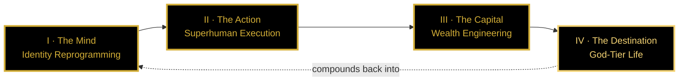

<div align="center">

```
██╗   ██╗██████╗     ██╗     ██╗███████╗███████╗    ██╗███████╗    ██╗   ██╗██████╗
██║   ██║██╔══██╗    ██║     ██║██╔════╝██╔════╝    ██║██╔════╝    ██║   ██║██╔══██╗
██║   ██║██████╔╝    ██║     ██║█████╗  █████╗      ██║███████╗    ██║   ██║██████╔╝
██║   ██║██╔══██╗    ██║     ██║██╔══╝  ██╔══╝      ██║╚════██║    ██║   ██║██╔═══╝
╚██████╔╝██║  ██║    ███████╗██║██║     ███████╗    ██║███████║    ╚██████╔╝██║
 ╚═════╝ ╚═╝  ╚═╝    ╚══════╝╚╝╚╝     ╚══════╝    ╚═╝╚══════╝     ╚═════╝ ╚═╝

         ▓▓▓  T H E   O P E R A T I N G   S Y S T E M   O F   T H E   O P E R A T O R  ▓▓▓
```

# **UR LIFE IS UP**

### *Absolute Focus · Zero Friction · Pure Dominance · Sovereign by Design*

> **This is not a platform. This is the operating system of the operator who refuses average.**
>
> The blueprint that forges the elite businessman and the high-performance supertrader.
> The substrate that compounds identity, capital, and time into sovereignty.

[]()
[]()
[]()
[]()
[]()

[**Declaration**](#-the-declaration) ·
[**Verdict**](#-the-verdict) ·
[**Code**](#-the-operators-code) ·
[**Movements**](#-the-four-movements) ·
[**Origin**](#-the-origin) ·
[**Creed**](#-the-creed)

</div>

---

## 🜂 The Declaration

UR LIFE IS UP is a **cognitive operating system upgrade** delivered through a 3D WebGL ceremony.

It exists to do one thing — and refuses to do anything else:

> **Forge the elite operator. Compress decades into days. End the era of average.**

This is not motivation. Motivation is the consolation prize of the unserious.
This is **architecture**. The architecture of identity, capital, and time, fused into a single executable trajectory.

---

## ⚜ The Verdict

The goals are not aspirations. They are **specifications.**

| Specification | Value | Status |
| :--- | :---: | :--- |
| **The Floor** | `$100,000,000 USD` | Non-negotiable. The floor — never the ceiling. |
| **The Hedge** | `5,000 KG of Gold` | Sovereign reserve. Hedge against every fiat collapse. |
| **The Identity** | `Unstoppable self` | The only acceptable version. All others are interim. |
| **The Sovereignty** | `Absolute` | Financial · Mental · Temporal · Geographic. |
| **The Timeline** | `Compressed` | Decades into days. Days into deployed leverage. |

> A goal without a number is a wish. A number without a system is a slogan. UR LIFE IS UP delivers both, in operating form.

---

## 🗝 The Operator's Code

Seven non-negotiables. Every movement of this system descends from these.

| # | Code | Translation |
| :---: | :--- | :--- |
| **I** | **Identity precedes outcome** | Become the operator first. The wins follow automatically. |
| **II** | **Asymmetry over effort** | One asymmetric bet beats one thousand symmetric trades. |
| **III** | **Speed of decision is the alpha** | The market does not reward correctness. It rewards correct decisions made faster. |
| **IV** | **Risk is the only currency** | Manage downside surgically. Upside takes care of itself. |
| **V** | **Compounding is sacred** | Never interrupt compounding — of capital, of skill, of identity. |
| **VI** | **Average is the enemy** | Average inputs produce average outputs. Average is a slow death. |
| **VII** | **Sovereignty is the destination** | Every action must increase optionality, not consume it. |

---

## 🧬 The Four Movements

The full journey from average to apex. Four movements. No skipping. No shortcuts that aren't already engineered into the system.



> The arrow back is not decoration. **Sovereignty re-funds identity.** The system is closed-loop. Every win at Movement IV makes Movement I stronger. This is why it compounds.

---

### Ⅰ · THE MIND
#### *Identity Reprogramming*

> The average mind produces average outcomes by design. Before any tactic, the substrate itself must be rewired.

The work of this movement is **destruction before construction**:

- **Destroy limiting beliefs.** Beliefs inherited from average people produce average results. They are software bugs. Patch them.
- **Rewire habits for decision speed.** Hesitation is the most expensive habit in capital markets. Strip it.
- **Forge emotional control.** The market punishes emotion at scale. Emotional control is not suppression — it is **conscious choice of state.**
- **Install systems thinking.** Stop optimizing single moves. Optimize the system that produces the moves.
- **Install asymmetric vision.** Train the eye to detect 10× opportunities the average mind walks past every day.

**Exit condition:** The operator no longer recognizes their previous self. The old defaults no longer activate. The new identity is the only available state.

---

### Ⅱ · THE ACTION
#### *Superhuman Execution*

> Execution is where 99% of operators die. Not because they don't know — because they don't ship.

The work of this movement is **time compression**:

- **20-day skill blueprints.** Spaced repetition + Feynman + active recall = top 1% in any high-value skill within twenty days. Not metaphorically. Operationally.
- **AI as personal multiplier.** Every repetitive cognitive task is delegated to AI. The operator's brain runs only on the work AI cannot do.
- **Automation everywhere it touches money.** Operations that don't compound get scripted. Operations that compound get protected.
- **Deep-work blocks.** Minimum 90-minute uninterrupted blocks for the only work that creates asymmetric value. Phone in another room. Notifications off.
- **The leap, not the climb.** While average operators climb linearly, the operator leaps via AI, leverage, and compounding curves.

**Exit condition:** The operator ships at a velocity that competitors cannot model. The output ratio is no longer 1:1 — it is 10:1, then 100:1.

---

### Ⅲ · THE CAPITAL
#### *Wealth Engineering & Supertrader Mechanics*

> Capital is the compressed form of every previous decision. Engineer capital like an architect, not a gambler.

The work of this movement is **surgical capital deployment**:

#### Market Mastery

- **Analyze global markets with lethal clarity.** Equities, FX, commodities, crypto, private deals — every market is a system with exploitable structure.
- **Hunt arbitrage gaps.** Mispriced attention, mispriced risk, mispriced time. The gaps are everywhere — only trained eyes see them.
- **Exploit underpriced attention.** The largest 10× returns of the next decade live in attention that the herd hasn't priced yet.

#### Risk Doctrine

> **The doctrine: minimize loss size. Maximize win size. Engineer positive expectancy that compounds infinitely.**

The operator does not chase win rates. The operator chases **expectancy with managed downside.** A 40% win rate with 5R winners eats a 90% win rate with 1R winners alive.

| Principle | Operational Translation |
| :--- | :--- |
| **Position sizing first** | Risk per trade is a function of capital, not conviction. Conviction is a bias. |
| **Asymmetric R-multiples** | Never accept less than 3R potential. Walk away from 1R setups regardless of "feel." |
| **Stop-loss is sacred** | The stop is set before entry. Never widened. Never rationalized. |
| **Defense before offense** | A drawdown that takes 50% to recover requires 100% gain. Defense protects the compound. |
| **Process over outcome** | Outcomes are noisy. Process is signal. Grade the process, not the P&L. |

#### Income Engine

Multiple uncorrelated income streams, each engineered for compounding:
- Trading edge (positive expectancy, surgical risk)
- Productized expertise (skills that pay in sleep)
- Equity in ventures (asymmetric upside via ownership)
- Sovereign reserves (gold, hard assets — the hedge against every fiat regime)

**Exit condition:** Capital generates capital. The operator's time is no longer the bottleneck. The compound is autonomous.

---

### Ⅳ · THE DESTINATION
#### *Designing the God-Tier Life*

> The destination is not luxury. The destination is **sovereignty.**

The work of this movement is **architecting the life that the previous three movements unlock**:

- **Time freedom** — calendars built around the operator's energy, not external demands.
- **Geographic freedom** — operate from anywhere. Be unanchored to any single jurisdiction.
- **Financial freedom** — capital that produces capital. No single income stream is load-bearing.
- **Cognitive freedom** — attention that the operator owns, not that algorithms harvest.
- **Identity freedom** — no version of the past self has voting rights in the present.
- **Empire scaling** — the operator's systems extend beyond themselves. The work outlives the operator.

**Exit condition:** None. This movement does not exit. It is the steady state. The compounding loop closes here and re-funds Movement I — at a higher altitude.

---

## ⚔ The Anti-Pattern

The system explicitly rejects:

- ❌ **Hustle theater.** Performative work without compounding output.
- ❌ **Symmetric bets.** Equal risk for equal reward is a tax on time.
- ❌ **Win-rate worship.** Win rate without expectancy is amateur theater.
- ❌ **Information consumption without execution.** Knowledge that doesn't ship is entertainment.
- ❌ **Identity tourism.** Trying on personas without committing to the substrate change.
- ❌ **Optionality hoarding.** Holding options is not strategy. Deploying them is.
- ❌ **Apologizing for ambition.** Ambition does not require permission. It requires execution.

> The shape of the operator is defined as much by what they refuse as by what they pursue.

---

## 🜔 The Origin

The empire's launchpad is **Cairo.**

Not Silicon Valley. Not London. Not Singapore.

**Cairo.**

Where empires have been launched for five thousand years. Where the pyramids were engineered with a precision that modern instruments still struggle to match. Where the timeline is measured in dynasties, not quarters.

The 3D Earth in the substrate spins, focuses, and locks onto a single coordinate. That coordinate is the operator's launchpad — and an unapologetic declaration:

> **The next great empires will rise where the first ones did. We do not borrow other people's geographies. We build from ours.**

---

## 🌌 The Digital Substrate

Philosophy without a substrate is theory. The substrate is the proof.

UR LIFE IS UP is delivered through an **elite, zero-friction 3D WebGL environment** — a cinematic, space-grade interactive journey that the visitor physically traverses. Every scroll, every shader, every easing curve is engineered to anchor the mindset into the nervous system, not just the cortex.

| Property | Implementation |
| :--- | :--- |
| **Engine** | Three.js + WebGL2 + custom hand-tuned GLSL shaders |
| **Motion** | GSAP + ScrollTrigger + Lenis smooth scroll |
| **Performance** | Hardware-tier detection, dynamic resolution scaling, 60fps floor |
| **Aesthetic** | Void Black `#000000` × Luxury Gold `#D4AF37` — no third state |
| **Architecture** | Five-stage render pipeline, frame budget ≤ 16.67ms |
| **Closure** | The 3D Earth focuses to Cairo, EG — the empire's launchpad |

> Full technical specification in [`ENGINE.md`](./ENGINE.md). The README you are reading is the philosophy. The engine doc is the proof.

---

## 🧭 Who This Is For

| Operator Type | Fit |
| :--- | :---: |
| Serious trader engineering positive expectancy | ✅ |
| Founder compounding identity → capital → empire | ✅ |
| High-performer rewriting their cognitive defaults | ✅ |
| Operator using AI as personal multiplier, not toy | ✅ |
| Anyone treating their digital surface as a weapon | ✅ |
| Tourist | ❌ |
| Motivational consumer | ❌ |
| Anyone seeking permission | ❌ |

---

## 📡 Contact

| Channel | Purpose |
| :--- | :--- |
| `ops@urlifeisup.com` | Engagements · serious operators only |
| `studio@urlifeisup.com` | Studio collaborations |
| `press@urlifeisup.com` | Media |

> Inquiries that begin with "I'm just curious" will not be returned. Inquiries that begin with a specification will.

---

## 📜 License

Proprietary. © 2026. All rights reserved.

The philosophy, architecture, blueprints, color tokens, motion sequences, shader pairs, and operating doctrines housed in this repository and its companion engine are protected intellectual property. **No reuse, redistribution, derivative work, or training of generative models is permitted without written commercial agreement.**

---

<div align="center">

## 🜂 The Creed

> **Identity precedes outcome.**
> **Speed of decision is the alpha.**
> **Risk is the only currency.**
> **Compounding is sacred.**
> **Average is the enemy.**
> **Sovereignty is the destination.**
>
> The work is not to want more.
> The work is to become the operator for whom more is the inevitable output.
>
> **Void is the discipline. Gold is the signal. Cairo is the launchpad.**
> **And the only acceptable identity is unstoppable.**

---

### **UR LIFE IS UP**

*The operating system of the operator who refuses average.*

[Declaration](#-the-declaration) · [Verdict](#-the-verdict) · [Code](#-the-operators-code) · [Movements](#-the-four-movements) · [Origin](#-the-origin) · [Creed](#-the-creed)

</div>
